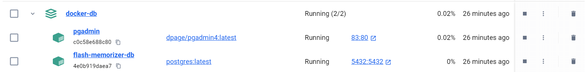
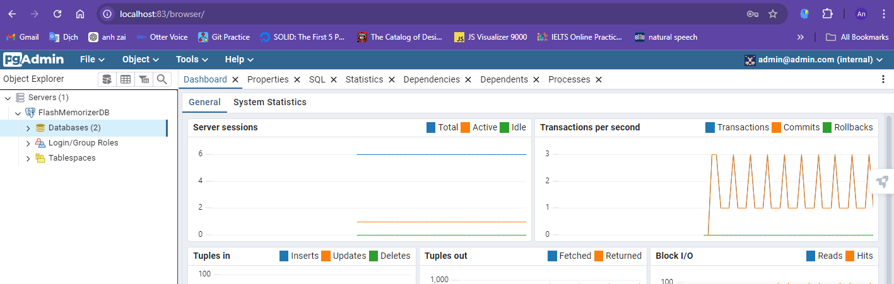
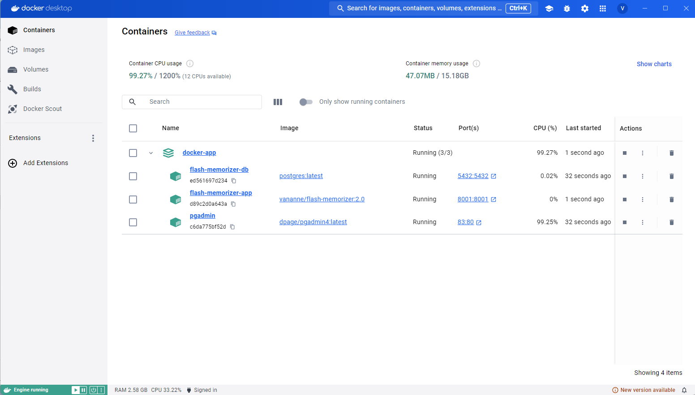

# **Flash memorizer**

_This application provides an immersive learning experience, allowing users to enhance their English language skills effortlessly. Furthermore, It also simplifies the memorization of challenging material, leading to time-saving and enhanced productivity._

## **Table of Contents**

- [Clone Repository](#clone-repository)
- [Access Path (URL)](#access-path-url)
- [Features](#features)
- [Technical](#technical)
- [Run Database in Docker](#run-database-in-docker)
    - [To Run](#to-run)
    - [Remove Container Without Deleting PostgreSQL Data](#remove-container-without-deleting-postgresql-data)
    - [Accessing pgAdmin4 (Web Version)](#accessing-pgadmin4-web-version)
- [Run The Application in Docker](#run-the-application-in-docker)
    - [To Run](#to-run-1)
    - [Remove Container Without Deleting PostgreSQL Data](#remove-container-without-deleting-postgresql-data-1)
- [Testing Accounts](#testing-accounts)

## **Clone repository**

```terminal
git clone https://github.com/UniversityWeb/flash-memorizer.git
```

## **[Access Path (URL)](http://localhost:8001/)**

- localhost:8001

## **Features**

1. Show Review Cards.
2. Flashcard Repetition Method.
3. Pronunciation Cards.
4. Apply Format Text for Each Card.
5. Auto-generate Multiple-Choice Questions with a Single Answer.

## **Technical**

1. Tools: IntelliJ IDE (Free Edition), Docker Desktop (or CLI version), pgAdmin4 (Web version).
2. SQL: PostgreSQL.
3. Backend framework: Spring boot.
4. UI: Bootstrap.
5. Concepts: JPA, Spring Security, MVC, SOLID, Design pattern.

## **Run Database in Docker**

Please note: You must be in the `docker-db` folder. The database will be opened on port `5432`.

### To Run

```
docker-compose up -d
```



#### Remove container without deleting PostgreSQL data

```
docker-compose down
```

### Accessing pgAdmin4 (Web version)
Once the Docker container is running, you can access the pgAdmin4 interface at:

URL: http://localhost:83 (replace localhost with the appropriate IP address if needed)
- Email Address: `admin@admin.com`
- Password: `admin`



Detail specs of PostgreSQL
- Connection Name: `Docker Provider`
- Hostname: `localhost`
- Port: `5432`
- Username: `root`
- Password: `root`

## **Run The Application in Docker**

Please note: You must be in the `docker-app` folder. The database and the application will be opened on ports `5432`, `83`, and `8001`, respectively.

### To Run

```
docker-compose up -d
```



#### Remove container without deleting PostgreSQL data

```
docker-compose down
```

## **Testing Accounts**
- Username: `vanan`.
- Password: `123456`.
