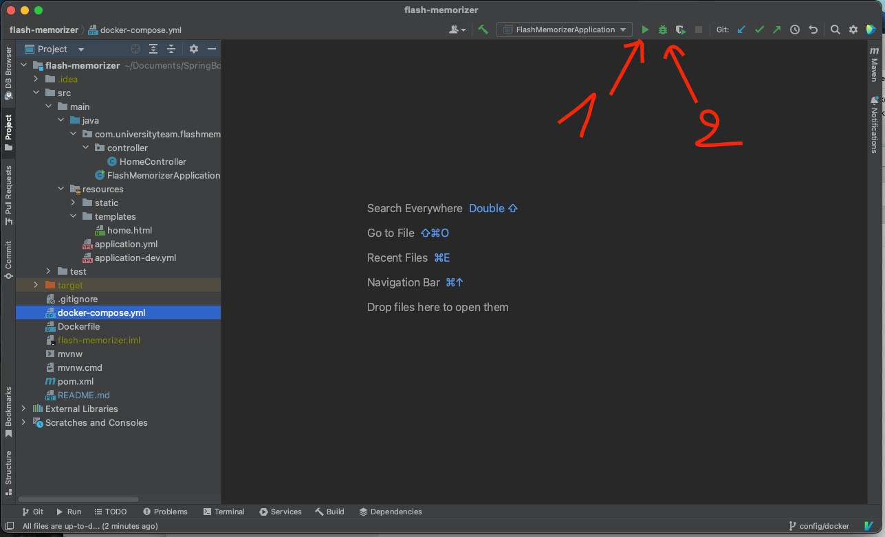

# **Flash memorizer**
*This application provides an immersive learning experience, allowing users to enhance their English language skills effortlessly.*

## **Clone repository**
```terminal
git clone https://github.com/AnhAnNek/flash-memorizer.git
```

## **Access Path (URL)**
```
..comming soon..
```

## **Features**
1. Show Review Cards.
2. Flashcard Repetition Method.
3. Pronunciation Cards.
4. Apply Format Text for Each Card.
5. Auto-generate Multiple-Choice Questions with a Single Answer.

## **Technical**
1. Tools: IntelliJ IDE, Docker, MySQL Workbench.
2. SQL: MySql.
3. Framework: spring boot.
4. UI: bootstrap.
5. Concepts: JPA, MVC, S and O in SOLID, Design pattern.

## **Run With Docker**

Setup
```
docker pull mysql:latest
```

To Run
```
docker-compose up --build
```

To stop
```
Ctrl + C
```

Remove container without deleting MySQL data
```
docker-compose down
```

To apply change

*Step 1:*
```
docker-compose build
```

*Step 2:*
```
docker-compose up --force-recreate
```

## **Run With IntelliJ**
Setup
```
docker pull mysql:latest
```

Step 1:
```
docker run -d --name flash-memorizer-db -p 3307:3306 -e MYSQL_ROOT_PASSWORD=root -e MYSQL_DATABASE=FlashMemorizer mysql:latest
```

Step 2:

1. To run
2. To debug

## **Reference Documentation**
...comming soon...
