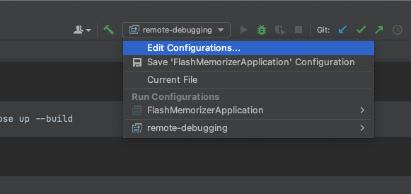
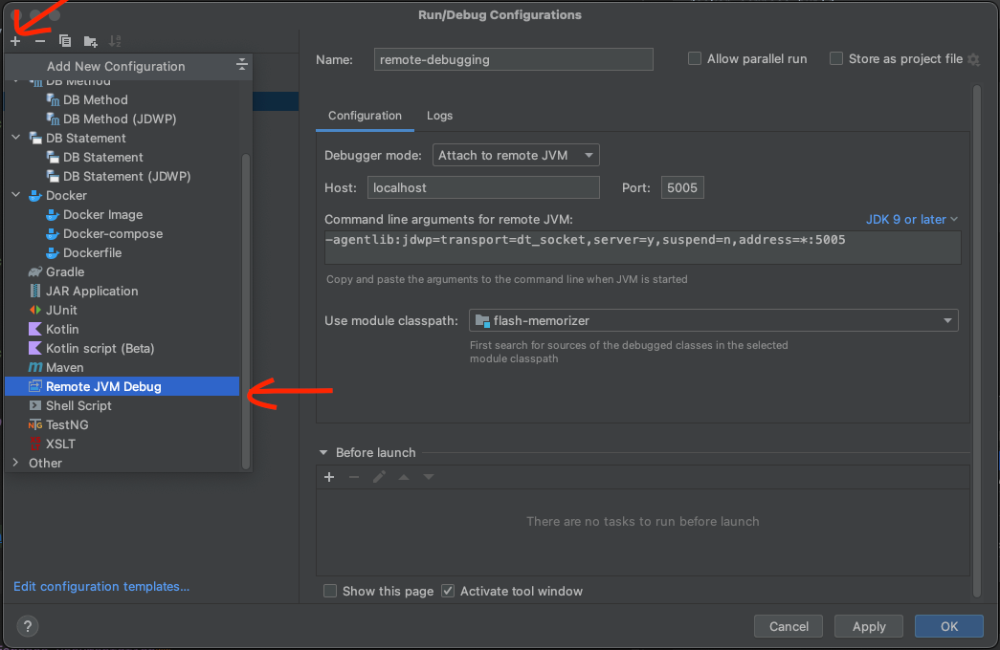
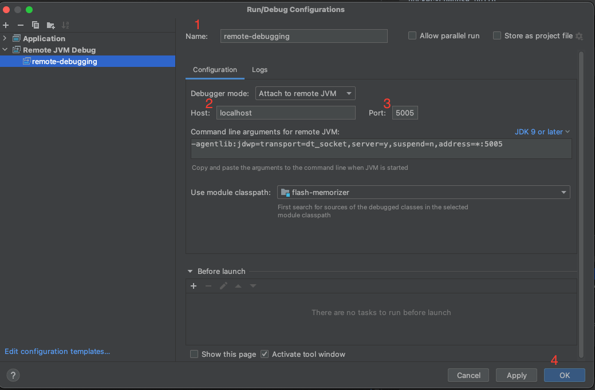
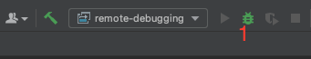

# **Flash memorizer**
*This application provides an immersive learning experience, allowing users to enhance their English language skills effortlessly.*

### Sections
- [Clone repository](#clone-repository)
- [Access Path (URL)](#access-path-url)
- [Run With Docker](#run-with-docker)
- [Debug](#debug)
- [Documentation](#documentation)

## **Clone repository**
```terminal
git clone https://github.com/AnhAnNek/flash-memorizer.git
```

## **[Access Path (URL)](http://localhost:8000/)**

## **Features**
1. Show Review Cards.
2. Flashcard Repetition Method.
3. Pronunciation Cards.
4. Apply Format Text for Each Card.
5. Auto-generate Multiple-Choice Questions with a Single Answer.

## **Technical**
1. Tools: IntelliJ IDE, Docker, MySQL Workbench.
2. SQL: MySql.
3. Framework: spring boot.
4. UI: bootstrap.
5. Concepts: JPA, Spring Security, MVC, SOLID, Design pattern.

## **Run With Docker**

### To Run
```
docker-compose up --build
```
###### *To stop*
```
Ctrl + C
```

#### Remove container without deleting MySQL data
```
docker-compose down
```

## **Debug**
### Setup

*Step 1: Click "Edit Configurations"*



*Step 2: Click "+" -> "Remote JVM Debug"*



*Step 3:*



1. Set Name: remote-debugging (or any name)
2. Set Host: localhost
3. Set Port: 5005
4. Click "Ok"

### Perform debugging on the running app



Set a breakpoint and click <1> to start debugging

## **Documentations**
...coming soon...
