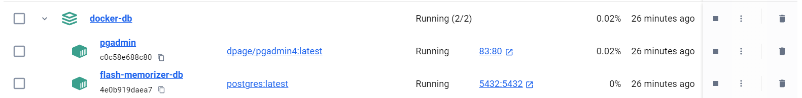
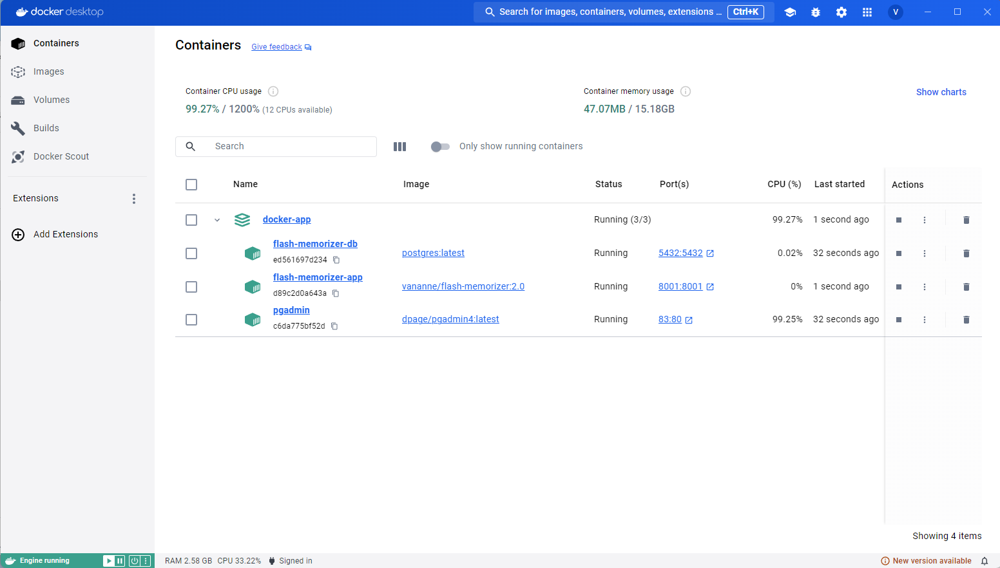
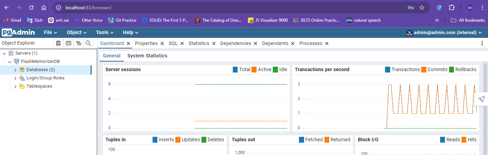

# **Flash memorizer**

[](https://sonar.vanannek.blog/dashboard?id=com.uniteam%3Aflash-memorizer&codeScope=overall)

_This application provides an immersive learning experience, allowing users to enhance their English language skills effortlessly. Furthermore, It also simplifies the memorization of challenging material, leading to time-saving and enhanced productivity._


## **Table of Contents**

- [Clone Repository](#clone-repository)
- [Access Path (URL)](#access-path-url)
- [Features](#features)
- [Technical](#technical)
- [Run Project with Docker](#run-project-with-docker)
    - [Prepare Environment Variables](#prepare-environment-variables)
    - [Run Database Only](#run-database-only)
    - [Run Full Stack (App + DB)](#run-full-stack-app--db)
    - [Stop Containers](#stop-containers)
    - [Accessing pgAdmin4 (Web Version)](#accessing-pgadmin4-web-version)
- [Auto Reload (Java/HTML)](#auto-reload-javahtml)
- [Testing Accounts](#testing-accounts)

## **Clone repository**

```terminal
git clone https://github.com/UniversityWeb/flash-memorizer.git
```

## **[Access Path (URL)](http://localhost:8005/)**

- localhost:8005

## **Features**

1. Show Review Cards.
2. Flashcard Repetition Method.
3. Pronunciation Cards.
4. Apply Format Text for Each Card.
5. Auto-generate Multiple-Choice Questions with a Single Answer.

## **Technical**

1. Tools: IntelliJ IDE (Free Edition), Docker Desktop (or CLI version), pgAdmin4 (Web version).
2. SQL: PostgreSQL.
3. Backend framework: Spring boot.
4. UI: Bootstrap.
5. Concepts: JPA, Spring Security, MVC, SOLID, Design pattern.

## **Run Project with Docker**

Please note: Run commands from the project root folder.

### Prepare Environment Variables

Create environment file for Docker app:

```terminal
copy docker-app\.env.example docker-app\.env
```

or (WSL/Linux):

```terminal
cp docker-app/.env.example docker-app/.env
```

Then update values inside `docker-app/.env`.

### Run Database Only

Database will be opened on port `5432` and pgAdmin on `83`.

```terminal
docker compose -f docker-app/docker-compose.db.yml up -d
```



### Run Full Stack (App + DB)

Application is exposed at `http://localhost:8005`.

```terminal
docker compose -f docker-app/docker-compose.yml -f docker-app/docker-compose.db.yml up -d --build
```



### Stop Containers

```terminal
docker compose -f docker-app/docker-compose.yml -f docker-app/docker-compose.db.yml down
```

### Accessing pgAdmin4 (Web version)
Once the Docker container is running, you can access the pgAdmin4 interface at:

URL: http://localhost:83 (replace localhost with the appropriate IP address if needed)
- Email Address: `admin@admin.com`
- Password: `admin`



Detail specs of PostgreSQL
- Connection Name: `Docker Provider`
- Hostname: `localhost`
- Port: `5432`
- Username: `flashuser`
- Password: `root`

## **Auto Reload (Java/HTML)**

The app container includes a watcher (`docker-app/docker-entrypoint.sh`) that compiles when source files change.

To check reload:

1. Start stack:

```terminal
docker compose -f docker-app/docker-compose.yml -f docker-app/docker-compose.db.yml up --build
```

2. In another terminal, watch app logs:

```terminal
docker compose -f docker-app/docker-compose.yml -f docker-app/docker-compose.db.yml logs -f flash-memorizer-app
```

3. Save a `.java` or `.html` file in `src/main`, then refresh browser at `http://localhost:8005`.

Expected logs: `Change detected, running mvn compile` and Spring Boot restart messages.

If needed, apply latest Docker changes to app container:

```terminal
docker compose -f docker-app/docker-compose.yml -f docker-app/docker-compose.db.yml up -d --build --force-recreate flash-memorizer-app
```

## **Testing Accounts**
- Username: `vanan`.
- Password: `123456`.
